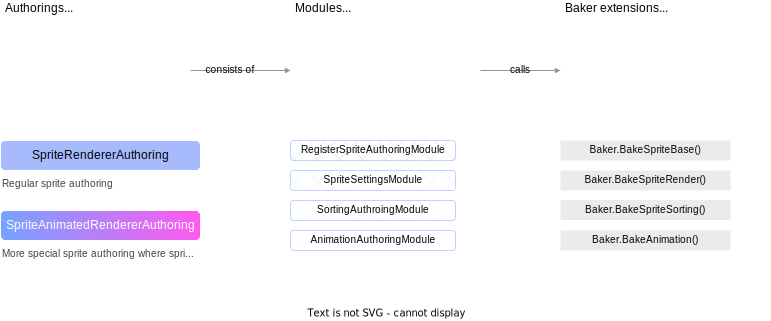

# Authoring workflow
This package provides flexible authoring possibilities to serve your purposes.

### Regular **Authorings**
The most simple way is to use ready monobehaviour authorings from this package 
such as [`SpriteRendererAuthoring`](https://github.com/Antoshidza/NSprites-Foundation/blob/main/Base/Authoring/SpriteRendererAuthoring.cs)
and [`SpriteRendererAuthoring`](https://github.com/Antoshidza/NSprites-Foundation/blob/main/Animation/Authoring/SpriteAnimationAuthoring.cs).
Those authorings gives you all data assigning you need to render sprites withing pipeline of this package.

* [SpriteRendererAuthoring](https://github.com/Antoshidza/NSprites-Foundation/blob/main/Base/Authoring/SpriteRendererAuthoring.cs) - bakes default render components. Adds [2D transform](2DTransform.md) components / removes unity default 3D transforms / adds sorting components.
* [SpriteAnimatedRendererAuthoring]() - same as previous, but also adds animation related components. Though not inherited from previous one (because it hard to keep all in place when you deal with unity serialization) 

### Modules
However you may want to implement your own register system or your own shader or some other components, I can never know.
So you may want to use authorings partially, for example you want to use only sorting bake part,
then you can use **Authoring Modules** which is just serialized types with `Bake()` method.
So you can use [`SortingAuthoringModule`](/Base/Authoring/Modules/SpriteSettingsAuthoringModule.cs)
and other modules as a field in your custom authoring `MonoBehaviour` class and call `Bake()` in `Baker<TAuthroing>` like
```csharp
public class FooAuthoring : MonoBehaviour
{
    private class Baker : Baker<FooAuthoring>
    {
        public void override Bake(FooAuthoring authoring)
        {
            aithoring.Sorting.Bake(this);
        }
    }
    
    public SortingAuthoringModule Sorting;
}
```

### Baker Extensions
Again however if modules doesn't fit your needs or have extra unnecessary data then you can
still use **Baker Extensions** which is used by modules. So if you still want to use sorting
but you, for example, don't need set any sorting data, because it constant, then you can do something like:
```csharp
public class FooAuthoring : MonoBehaviour
{
    private class Baker : Baker<FooAuthoring>
    {
        public void override Bake(FooAuthoring authoring)
        {
            this.BakeSpriteSorting
            (
                GetEntity(TransformUsageFlags.None),
                SortingIndex,
                SortingLayer,
                UseStaticSorting
            );
        }
    }
    
    private const int SortingIndex = 0;
    private const int SortingLayer = 0;
    private const bool UseStaticSorting = false;
}
```

### You can look at diagram below to see how this parts related to each other.



# Assets used with authoring workflow
* [`PropertiesSet`](https://github.com/Antoshidza/NSprites-Foundation/blob/main/Base/Data/PropertiesSet.cs) - contains properties components names with update strategy type (read more about [properties](https://github.com/Antoshidza/NSprites/wiki/Register-components-as-properties) and [update modes](https://github.com/Antoshidza/NSprites/wiki/Property-update-modes)).
This `ScriptableObject` used by **authoring** / **modules** / **extensions** to bake registration data. You can create it by call context menu in project `Create/NSprites/Properties Set`.
* [`SpriteAnimation`](/Animation/Data/SpriteAnimation.cs) & [`SpriteAnimationSet`](/Animation/Data/SpriteAnimationSet.cs) - scriptable objects, first contains animation data and second contains a set of `SpriteAnimation`
